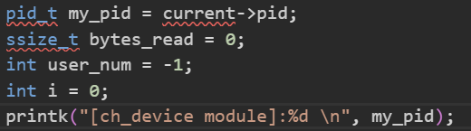

# Linux 动态模块

- **Monolithic 类型内核**：单一大程序，需要使用动态模块（动态加载和卸载）来为内核添加或者删去代码块。
- **insmod**：可以显式加载内核模块的目标代码（.ko 文件）。  
  `.ko 文件`（Kernel Object File）是 Linux 内核模块文件，是编译器将内核模块源代码（如 .c 文件）编译后生成的文件。它与 `.o 文件` 类似，但特定于 Linux 内核，包含了可以动态加载到内核中的代码。

- **Reentrancy（可重入性）**：代码可以被多个上下文（多个进程或者多个处理器）同时调用而不出错误。
    - 使用锁
    - 禁止敏感数据访问时的中断
    - 使用内核提供的原子操作（atomic_t）
    - 避免全局变量
    - 使用同步机制

---

# Linux 5.x 内核模块签名机制

- 确保加载进入内核的模块安全可靠。

---

# Linux 设备驱动

## File Inode

- **inode**：在内核内部用于表示一个文件，而 **file** 表示一个已经打开的文件。
  - `inode` 中的 `dev_t i_rdev` 和 `struct cdev *i_cdev`：
    - `i_rdev`：设备号，表示一个设备。
    - `i_cdev`：用于表示字符设备的指针，当 inode 结点指向一个字符设备文件时，此域为指向 inode 结构的指针（不理解）。

- **File**：
  - `fmode_t f_mode`：用于标识读写权限。
  - `loff_t f_pos`：指明文件的当前位置。
  - `unsigned int f_flags`：文件标志，`O_NONBLOCK` 表示文件是否有阻塞请求。
  - `struct file_operations *f_op`：与文件相关的操作。
  - `void *private_data`：用于在系统调用期间保存各种状态信息。

---

## Chardevs 数组

- 所有的字符设备都存在 `chardevs` 数组中。分配了设备号后，会创建 `char_device_struct` 对象，并添加到 `chardevs` 中。
- **register_chrdev_region()**：分配指定的设备号范围。
- **alloc_chrdev_region()**：动态分配设备范围。

这两个函数主要是通过调用 `__register_chrdev_region()` 来实现设备号的注册。注意，这两个函数仅仅是注册设备号。如果要和 `cdev` 关联起来，还需要调用 `cdev_add()`。

- **register_chrdev()**：申请指定的设备号，并将其注册到字符设备驱动模型中。
    - 注册设备号，通过 `__register_chrdev_region()` 来实现。
    - 分配一个 `cdev`，通过 `cdev_alloc()` 来实现。
    - 将 `cdev` 添加到驱动模型中，通过 `cdev_add()` 来实现。
    - 将创建的 `struct char_device_struct` 对象的 `cdev` 指向分配的 `cdev`。需要注意，`register_chrdev()` 是老接口，新的接口中不需要这一步。

---

## Linux 设备驱动的特点

- **内核代码的一部分**：需要为内核和其他子系统提供接口。
- **可装载性和动态性**：允许在运行时动态加载和卸载。
- 提供与操作系统及设备交互的接口（通过 `file_operations` 完成）。
- 使用内核机制和服务。

---

## VFS（虚拟文件系统）

虚拟文件系统（VFS）是计算机操作系统中的一个抽象层，提供统一的接口，允许不同的文件系统通过相同的 API 进行访问。VFS 使得操作系统能够支持多种不同类型的文件系统（如 FAT、NTFS、ext4 等），而不需要用户和应用程序知道底层实现的细节。

---

# 遇到的问题

## 系统调用篡改

- **问题描述**：在执行 `insmod` 命令后，SSH 会断开连接，且无法正常安装成功动态模块。  
  安装模块后，会多次调用该篡改后的函数：
  **猜测原因**：
    - ssh连接的时效性问题，安装模块可能需要一定的实际，但是这个时间有些长，导致ssh断开连接
        **尝试解决**：修改sshd_config文件中的ssh会话的存活时间
        **结果**：还是会断开，初步排除此问题。
    - 内核崩溃：此处需要修改linux的系统调用内容，可能会触发一些linux的内核保护机制，导致内核崩溃。
        **尝试解决**：修改了`CONFIG_STRICT_KERNEL_RWX=n`,`CONFIG_HARDENED_USERCOPY=n`,`CONFIG_KALLSYMS=n`等安全参数
        **结果**:服务器崩溃，ssh无法再连接上。
    - 查询到`ffff000008af0698 sys_call_table ffff000008af3a98 a32_sys_call_tabl`两个系统调用表的存放地址（使用`cat /proc/kallsyms | grep sys_call_table`命令，通过该表对系统调用进行修改，但是依然会导致系统崩溃
    - 需要打开写保护，系统调用表是有写保护的，禅师对它写的时候会导致系统的奔溃，在写之前要关闭写保护。
  
  注释hello中的printk
  
  - 但是，运行modify_new函数的时候，输出值为很大的值，怀疑篡改错误
  **猜测原因：**
    - 篡改错误，篡改到了一个其他的函数，导致返回值是一个大值，但是我认为linux内核函数应该不会有返回该无规则大值的情况，所以这个可能性较低。
    - a，b参数在传递时出现了错误。询问chatgpt后得到回复：arm架构的系统调用在传递参数时是通过寄存器来传递的r0,r1,r2,r3分别对应第1，2，3，4个参数。而syscall(78, 10, 20)中的78存储在r7寄存器中。所以，修改的函数应该从寄存器中提取参数，但是实验给的示例代码是通过堆栈传递参数的，但是系统调用传递的参数并没有存储在堆栈，而是寄存器，所以这样会导致输出无意义的巨大的值。修改后值传递方式后，成功：
    
---

## 聊天程序

- **问题描述**：设备模块已正确使用 `insmod` 加载，但用户程序仍无法正常 `open`。  
  解决方法：使用 `sudo mknod /dev/ch_device c 290 0` 创建设备节点后解决问题。
  
  

---

- **发送消息错误**：  
  在以下情况下出现错误：
  
  

  **初步分析**：该错误可能是由于，在选择发送消息时，子进程和父进程都在运行，但父进程没有正确运行，导致输入的内容进入父进程的缓冲区。  
  **解决方法**：在子进程执行时，阻塞父进程。

  **进一步问题**：阻塞父进程不能解决问题，且阻塞会导致程序停止。  
  **查询**：查询后发现同一会话中只能有一个前台进程组，其他进程属于后台进程组，无法接收到键盘输入。

  **尝试**：能否在新建的子进程中调用 `exec` 族函数，爆破当前子进程并生成一个终端？
        但是实际运行后依然无法实现效果，终端无法正常出现。
  ```c
  setsid();  // 创建新的会话，脱离当前终端
  execlp("xterm", "xterm", "-e", "./child_process_program", (char* NULL);
  ```


- 考虑后决定转换思路:手动在终端运行用户，每运行一个程序就当作一个用户
上面已经实现的字符设备和字符串处理部分大都可以继承。

- 在设备的读函数中，刚开始注册用户时，会输出一次[ch_device module]:user is not alive!日志如下：

**猜测原因**：第一次read时，设备注册还没完成。
**解决思路**：在循环读消息前，先sleep(1)，用户创建完成后再读消息。但是sleep(1)后依然没有解决问题

**找到原因**：
日志如下：

**原因**：

这里的pid貌似为0，没有正确的传递给字符模块（输出位置错误）
**真实原因**：


这里的pid差了1，需要给current->pid - 1 来进行解决。初步查询资料，结论：linux的线程处理机制与进程不太相同，Linux严格来说没有线程，而是使用了进程来模拟线程，所以这这里的pid会不同

- 但是修改后问题依然得不到解决，此时的问题是：创建多个用户后，用户无法接收到其他用户发来的消息（群发私聊都不行）
很快找到了原因：read中用于查找用户，使用的current->pid没有减1，导致不能通过pid来找到用户。解决后正确实现了聊天程序